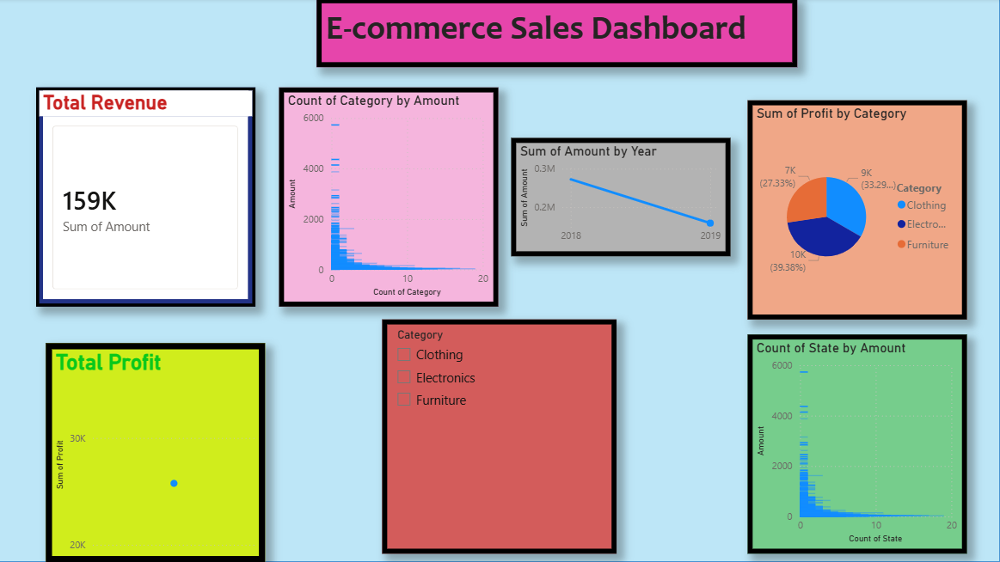

# 🛍️ E-commerce Sales Dashboard

## 📊 Overview
This project analyzes e-commerce sales data using Power BI to generate meaningful business insights. The dashboard provides a clear view of sales performance, customer behavior, and product trends.

## 🚀 Features
- Total Revenue & Profit analysis
- Sales trends over time
- Category-wise performance
- State-wise sales analysis
- Interactive filters (slicers)

## 🛠 Tools Used
- Power BI
- Excel / CSV Dataset

## 📈 Key Insights
- Top categories contribute majority of revenue
- Sales show seasonal fluctuations
- Few regions dominate overall sales
- Profit varies across categories

## 📸 Dashboard Preview

## 📂 Files Included
- Power BI file (.pbix)
- Dataset files (Orders, Details)
- Dashboard screenshot
